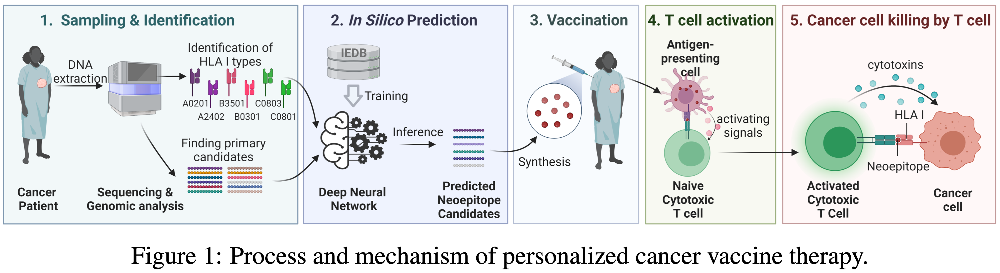
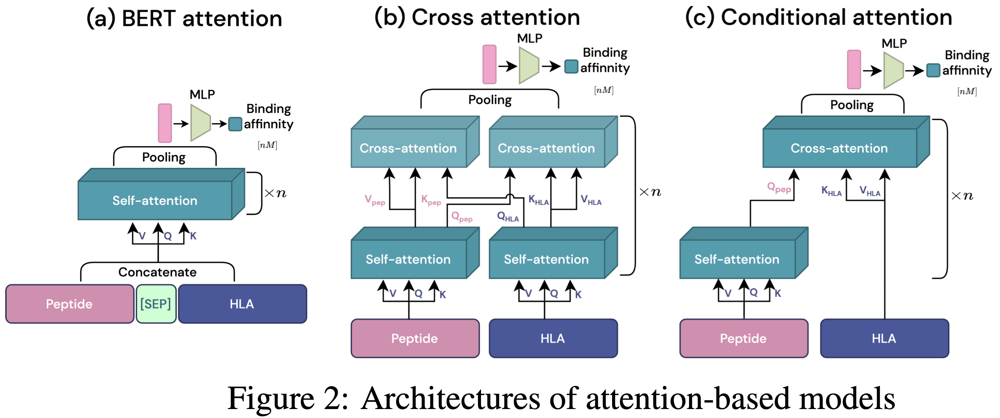

# My Paper Title

This repository is the official implementation of [Allele-conditional attention mechanism for
HLA-peptide complex binding affinity prediction]. 

<!-- >📋  Optional: include a graphic explaining your approach/main result, bibtex entry, link to demos, blog posts and tutorials -->



## Requirements

To install requirements:

```setup
conda env create -f environments.yml
```

<!-- >📋  Describe how to set up the environment, e.g. pip/conda/docker commands, download datasets, etc... -->

## Training

To train the model(s) in the paper, run commands like:

```train
bash run_5fold_train_{model_name}.sh
```
Available model_names are: 
{transformer(Conditional attention), 
 bertlike(Bert attention),
 cross_transformer(Cross attention),
 gru, cnn}

To evaluate certain model architecture, you can comment out rest of the code and run bash file.

You can select gpu device number for each fold with --gpu_id arguments.

Changing featurization scheme and pooling scheme is also possible,
by selecting --emb_type among {"aa2"(AA+AA), "aa+esm"(AA+ESM), "re"(Learned Embedding)} 
and --pool_type among {"average"(Mean pooling), "conv"(Learned weighting), "token"([CLS] token)}

<!-- >📋  Describe how to train the models, with example commands on how to train the models in your paper, including the full training procedure and appropriate hyperparameters. -->

## Evaluation

To evaluate model , run:

```eval
bash run_5fold_val_{model_name}.sh
```
To evaluate certain model architecture, you can comment out rest of the code and run bash file.

You can select gpu device number for each fold with --gpu_id arguments.

<!-- >📋  Describe how to evaluate the trained models on benchmarks reported in the paper, give commands that produce the results (section below). -->
<!-- 
## Pre-trained Models

You can download pretrained models here:

- [My awesome model](https://drive.google.com/mymodel.pth) trained on ImageNet using parameters x,y,z. 

>📋  Give a link to where/how the pretrained models can be downloaded and how they were trained (if applicable).  Alternatively you can have an additional column in your results table with a link to the models.

## Results

Our model achieves the following performance on :

### [Image Classification on ImageNet](https://paperswithcode.com/sota/image-classification-on-imagenet)

| Model name         | Top 1 Accuracy  | Top 5 Accuracy |
| ------------------ |---------------- | -------------- |
| My awesome model   |     85%         |      95%       |

>📋  Include a table of results from your paper, and link back to the leaderboard for clarity and context. If your main result is a figure, include that figure and link to the command or notebook to reproduce it. 


## Contributing

>📋  Pick a license and describe how to contribute to your code repository.  -->